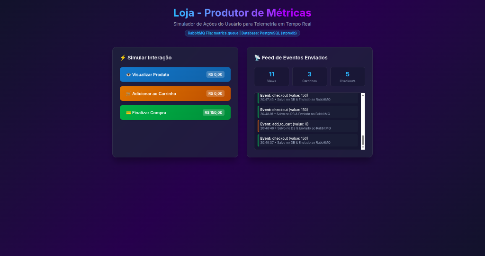
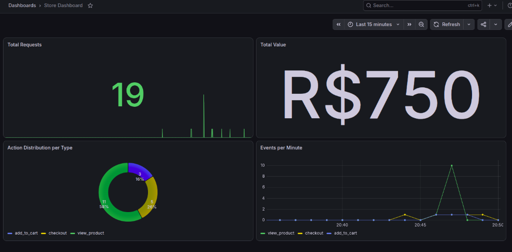

# 🚀 Store Observability PoC

Uma Prova de Conceito (PoC) completa de **Arquitetura de Observabilidade e Ingestão de Métricas em Tempo Real** utilizando **Spring Boot (Java 25)**, **RabbitMQ**, **PostgreSQL**, **Elasticsearch** e **Grafana**, orquestrados via **Docker Compose**.

---

## 📸 Demonstração do Sistema

### 1. Aplicação Produtora de Métricas (`loja-service`)
Interface interativa que simula compras e navegação do usuário em tempo real, persistindo os dados no PostgreSQL e disparando eventos assíncronos no RabbitMQ:



### 2. Dashboard de Observabilidade (`Grafana`)
Painel em tempo real consumindo os dados agregados do Elasticsearch, exibindo total de requisições, faturamento acumulado em R$, distribuição do funil de conversão e gráfico temporal por minuto:



---

## 📐 Arquitetura do Sistema

```mermaid
flowchart TD
    subgraph UI ["Interface do Usuário (Navegador)"]
        User["🌐 Usuário / Simulador Web"]
    end

    subgraph App ["Aplicação Transacional"]
        Loja["🛒 loja-service (Porta 8080)\nSpring Boot"]
    end

    subgraph Persistence ["Persistência Relacional"]
        Postgres[("🐘 PostgreSQL (Porta 5432)\nDatabase: storedb\nVolume: postgres_data")]
    end

    subgraph Messaging ["Mensageria Assíncrona"]
        RabbitMQ["🐰 RabbitMQ (Portas 5672 / 15672)\nFila: metrics.queue"]
    end

    subgraph Telemetry ["Pipeline de Telemetria & Batching"]
        Collector["⚙️ collector-service (Porta 8081)\nConsumer + Concurrent Buffer"]
    end

    subgraph StorageAnalytics ["Busca & Analytics"]
        ES[("🔍 Elasticsearch 8.12.0 (Porta 9200)\nIndex: metrics-poc\nVolume: es_data")]
    end

    subgraph Visualization ["Visualização"]
        Grafana["📊 Grafana (Porta 3000)\nStore Dashboard"]
    end

    User -->|Simula Ações HTTP POST / GET| Loja
    Loja -->|1. Persiste Interação JPA| Postgres
    Loja -->|2. Emite Métricas| RabbitMQ
    RabbitMQ -->|Consome Mensagens| Collector
    Collector -->|3. Bulk Ingest (Batching)| ES
    Grafana -->|Consulta Séries Temporais| ES
```

---

## 📦 Módulos do Monorepo

O projeto foi construído em formato **Maven Monorepo** estruturado em dois microserviços principais:

### 1. `loja-service` (Porta 8080)
* **Função**: Simula a aplicação de e-commerce real.
* **Persistência Relacional**: Grava o histórico de interações (`view_product`, `add_to_cart`, `checkout`) no banco **PostgreSQL** usando **Spring Data JPA**.
* **Produtor de Eventos**: Publica cada ação do usuário na fila `metrics.queue` do **RabbitMQ**.
* **Interface Thymeleaf**: Exibe uma UI moderna com contadores sincronizados com o PostgreSQL em tempo real.

### 2. `collector-service` (Porta 8081)
* **Função**: Agente coletor de telemetria de alta performance.
* **Consumidor RabbitMQ**: Escuta os eventos da fila assincronamente.
* **Estratégia de Batching (Buffer)**:
  * Armazena eventos em uma fila thread-safe `ConcurrentLinkedQueue`.
  * **Gatilho por Tamanho**: Dispara ingestão imediata ao atingir `100` mensagens no buffer.
  * **Gatilho por Tempo**: Executa um *flush* agendado a cada `5000 ms` (5 segundos) via `@Scheduled`.
* **Ingestão Bulk**: Envia lotes de métricas diretamente para a **Bulk API do Elasticsearch**.

---

## 🛠️ Tecnologias Utilizadas

* **Linguagem**: Java 25 / Spring Boot 3.4+ / Maven
* **Mensageria**: RabbitMQ 3 (com painel de gerenciamento)
* **Banco de Dados Relacional**: PostgreSQL 16 (com Docker Named Volumes)
* **Engine de Busca & Telemetria**: Elasticsearch 8.12.0
* **Visualização de Dados**: Grafana (Latest)
* **Conteinerização**: Docker & Docker Compose

---

## 🔌 Endpoints e Portas do Sistema

| Serviço | Container | Porta Host | Descrição / Acesso |
| :--- | :--- | :--- | :--- |
| **Loja Web** | `poc-loja-service` | `8080` | [http://localhost:8080](http://localhost:8080) |
| **Collector** | `poc-collector-service` | `8081` | Servidor interno de coleta |
| **RabbitMQ Dashboard** | `poc-rabbitmq` | `15672` | [http://localhost:15672](http://localhost:15672) (`guest`/`guest`) |
| **Elasticsearch** | `poc-elasticsearch` | `9200` | [http://localhost:9200](http://localhost:9200) |
| **Grafana** | `poc-grafana` | `3000` | [http://localhost:3000](http://localhost:3000) (`admin`/`admin`) |
| **PostgreSQL** | `poc-postgres` | `5432` | `jdbc:postgresql://localhost:5432/storedb` |

---

## 🚀 Como Executar o Projeto

### Pré-requisitos
* **Docker** e **Docker Compose** instalados na máquina.

### Execução Completa em 1 Comando

Na raiz do repositório, execute:

```bash
docker compose up -d --build
```

O Docker Compose irá construir os arquivos `.jar` das aplicações Spring Boot e subir todo o ambiente de infraestrutura automaticamente.

---

## 📊 Configuração do Dashboard no Grafana

1. Acesse o Grafana em [http://localhost:3000](http://localhost:3000) (Login: `admin` / Senha: `admin`).
2. Vá em **Connections** ➔ **Data Sources** ➔ **Add data source** ➔ Escolha **Elasticsearch**.
3. Configuração da Data Source:
   * **URL**: `http://elasticsearch:9200`
   * **Index name**: `metrics-*`
   * **Time field name**: `timestamp`
   * Clique em **Save & test**.
4. **Construindo o Dashboard**:
   * **Total Requests (Stat)**: Metric `Count`.
   * **Total Value (Stat)**: Metric `Sum` -> Field `value`.
   * **Action Distribution (Donut Chart)**: Metric `Count`, Group By `Terms` -> `action`.
   * **Events per Minute (Time Series)**: Metric `Count`, Group By `Date Histogram` -> `timestamp`, Then By `Terms` -> `action`.

---

## 💾 Retenção de Dados Persistentes

O arquivo `docker-compose.yml` está configurado com volumes nomeados para garantir a persistência dos dados:
* `postgres_data`: Preserva o histórico de vendas e interações do banco de dados relacional.
* `es_data`: Preserva todos os documentos indexados no Elasticsearch.

Mesmo se você parar ou destruir os containers (`docker compose down`), seus dados continuarão salvos e disponíveis na próxima execução.
